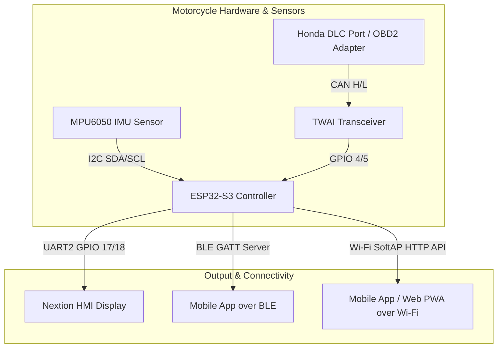

# Honda CL250 Motorcycle Telemetry System - Context & Architecture Guide

## 1. Project Overview & Objectives
The **Honda CL250 Telemetry System** is a modular embedded automotive/motorcycle telemetry platform designed for the ESP32-S3 microcontroller. It bridges the motorcycle's ECU diagnostic port with a handlebar-mounted Nextion HMI display, extra sensor modules, and smartphone mobile applications (Flutter / Web Bluetooth).

### Core Objectives:
1. **ECU Data Acquisition**: Read real-time engine telemetry from the Honda CL250 DLC (Data Link Connector) OBD-II port over CAN bus using UDS (Unified Diagnostic Services - ISO 14229) protocol.
2. **Handlebar Display**: Stream live telemetry gauges (RPM, Speed, Coolant Temp, Throttle %, Voltage, Lean Angle) to a Nextion HMI display over UART.
3. **Riding Dynamics & Extra Sensors**: Calculate motorcycle roll/lean angle in real-time using an MPU6050 IMU sensor with complementary filtering, tracking peak left and peak right lean angles.
4. **Extensible Modular Architecture**: Provide an object-oriented polymorphic C++ interface (`IModule`) allowing developers to plug in new sensors (GPS, TPMS tire pressure, SD logger, quickshifter data) without altering core code.
5. **Multi-Transport Mobile Integration**: Stream data over Bluetooth Low Energy (BLE GATT Server) and Wi-Fi SoftAP (`Honda-CL250-AP` HTTP REST/JSON API), enabling mobile apps to render cockpit dashboards and feed smartphone telematics (music track info, turn-by-turn navigation) back to the bike's screen.

---

## 2. Hardware Architecture & Pinout Map

| Subsystem | Component | Pins / Protocol | Configuration / Parameters |
|---|---|---|---|
| **MCU Core** | ESP32-S3 DevKit C-1 | USB Serial @ 115200 baud | Debug logging output |
| **Honda ECU DLC/OBD2** | TWAI CAN Transceiver | TX: `GPIO_NUM_4`, RX: `GPIO_NUM_5` | ISO 11898-1 CAN @ 500 kbps |
| **Nextion HMI Display** | HardwareSerial 2 | TX: `GPIO_NUM_17`, RX: `GPIO_NUM_18` | UART @ 115200 baud (SERIAL_8N1) |
| **IMU Sensor** | MPU6050 Accelerometer/Gyro | SDA: `GPIO_NUM_1`, SCL: `GPIO_NUM_2` | Fast I2C @ 400 kHz (Addr: `0x68`) |
| **BLE Wireless** | ESP32 BLE Stack | Standard GATT Server | Telemetry Notify + Telematics Write |
| **Wi-Fi Wireless** | ESP32 SoftAP Mode | SSID: `Honda-CL250-AP` | HTTP Server Port 80 (`/api/telemetry`) |



---

## 3. CAN Bus & Honda UDS Diagnostic Protocol

Communication with the Honda ECU is established over CAN bus (500 kbps) via UDS (ISO 14229) frame formats:

- **Request Message ID**: `0x18DA10F1` (Extended 29-bit CAN ID)
- **Response Message ID**: `0x18DAF110` (Extended 29-bit CAN ID)

### Frame Queries:
1. **Extended Diagnostic Session Start**: Sent during initialization (`0x02 0x10 0x03 0xAA 0xAA 0xAA 0xAA 0xAA`).
2. **Tester Present / Keep-Alive**: Sent every 1000ms (`0x02 0x3E 0x80 0xAA 0xAA 0xAA 0xAA 0xAA`).
3. **High-Frequency Request (20Hz / 50ms)**:
   - `DID 0xF40C`: Engine RPM (`RPM = ((Byte4 << 8) | Byte5) / 4.0`)
4. **Low-Frequency Sequential Requests (5Hz / 200ms)**:
   - `DID 0xF40D`: Vehicle Speed in km/h (`Speed = Byte4`)
   - `DID 0xF405`: Engine Coolant Temperature (`Temp = Byte4 - 40 °C`)
   - `DID 0xF411`: Throttle Position Percentage (`TPS = Byte4 * 100 / 255 %`)
   - `DID 0xF442`: Battery Voltage (`Voltage = ((Byte4 << 8) | Byte5) / 1000.0 V`)

---

## 4. Nextion HMI Display Data Interface

Data is sent to Nextion components via serial commands terminated by `0xFF 0xFF 0xFF`:

| Nextion Component | Type | Format | Description |
|---|---|---|---|
| `n_rpm.val` | Numeric | Integer | Engine RPM |
| `n_speed.val` | Numeric | Integer | Speed (km/h) |
| `n_temp.val` | Numeric | Integer | Coolant Temp (°C) |
| `n_tps.val` | Numeric | Integer | Throttle Position (%) |
| `n_volt.val` | Numeric | Integer | Battery Voltage * 10 (e.g. 124 = 12.4V) |
| `n_lean.val` | Numeric | Integer | Roll Lean Angle (Degrees) |
| `t_song.txt` | String | String | Current Song Title from Smartphone |
| `n_navdist.val` | Numeric | Integer | Navigation Distance (Meters) |

---

## 5. Extensible Modular Architecture (`IModule`)

All system components implement the unified abstract `IModule` C++ interface:

```cpp
class IModule {
public:
    virtual ~IModule() {}
    virtual bool begin() = 0;
    virtual void update(SystemState& state) = 0;
};
```

### Adding a New Sensor Module (e.g., TPMS / Tire Pressure):
1. Create `TPMSModule.h` and `TPMSModule.cpp` inheriting from `IModule`.
2. Implement `begin()` for hardware startup and `update(SystemState& state)` for periodic updates.
3. Add any new fields to `SystemState.h` (e.g., `struct TireData`).
4. Instantiate the new module in `src/main.cpp` and register it inside the `modules[]` array:
   ```cpp
   TPMSModule tpmsModule;
   IModule* modules[] = { &canModule, &imuModule, &displayModule, &bleModule, &wifiModule, &tpmsModule, &loggerModule };
   ```

---

## 6. Mobile Application Integration Suite

The project includes a complete mobile cockpit suite inside [`mobile_app/`](file:///Users/alihanesentas/Desktop/HondaCl250_Telemetry/mobile_app/):

1. **Web Bluetooth PWA App (`mobile_app/index.html`)**:
   - Zero-compilation mobile web app running in Safari/Chrome/Blueify.
   - Features animated 60fps RPM tachometer gauge, speedometer, interactive rotating motorcycle lean angle visualizer, health metrics, and telematics sync controller.
   - Built-in **Demo Simulator** for testing without physical hardware.

2. **Native Flutter App (`mobile_app/flutter_app/`)**:
   - Cross-platform native mobile app for Android & iOS (`lib/main.dart`, `lib/services/ble_service.dart`, `lib/models/telemetry_data.dart`, `lib/ui/dashboard_screen.dart`).
   - Configured with native BLE & Wi-Fi permissions in `AndroidManifest.xml` and dependencies in `pubspec.yaml`.
